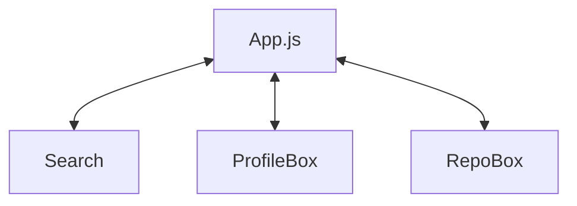

# GIT Finder

## 코드 설명

JS를 이용하여 OOP 사용 (객체 지향을 사용하기 위해 Utils 파일들은 Class로 작성 컴포넌트 파일들은 function component로 작성하였습니다.)
비동기 API 호출 (API 호출시 Async await을 사용하여 비동기 호출을 사용하였습니다 위치 = GitApi.js, App.js에서 확인하실 수 있습니다.)
잔디밭 기능 혹은 Sprint 추가. (잔디심기 기능을 추가하였고 API가 레포별로만 제공을 하여서 Grapql으로 하면 가능하지만 Axios를 이용한 API로 data를 제공 받고있기 떄문에 사용자마다 있는 메인 레포를 받게 하였습니다.)

### 폴더 구조

assets : css, img등 파일들을 작성하기 위한 폴더

- common.css

json : 정적 json을 작성해놓는 폴더

- random.json (random 함수를 실행시키기 위한 데이터를 저장한 파일)

utils : 모든 파일에서 사용하기 위한 Utils성 파일들 작성

- GitApi.js (GIT API 호출 클래스)
- Random.js (Random 함수를 담은 클래스)
- Utils.js (전체 파일에서 사용하기 위한 함수를 담기위한 클래스)

components : 메인 파일인 App.js에 컴포넌트 구조로 작성하기 위한 파일들을 작성

- Search.js (검색 부분의 내용이 담긴 컴포넌트)
- ProfileBox.js (검색한 유저의 Git 정보를 설명하는 내용이 담긴 컴포넌트)
- GitHubGrass (사용자 프로필 페이지 커밋 기록을 잔디 심어주는 컴포넌트)
- RepoBox.js (검색한 유저의 Repo들의 정보를 설명하는 내용이 담긴 컴포넌트)

### 컴포넌트 구조

