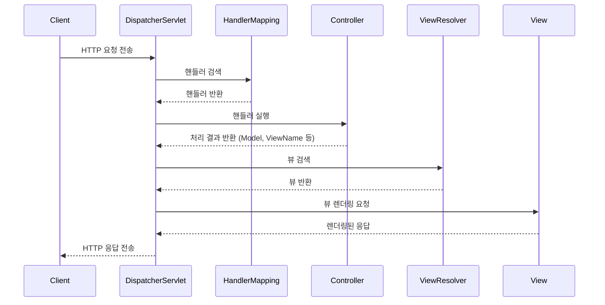

# 스프링 MVC

## 스프링 MVC의 요청-응답 흐름 이해, DispatcherServlet의 동작 방식 요약

`DispatcherServlet`은 스프링 MVC에서 **프론트 컨트롤러(Front Controller)** 역할을 수행하는 핵심 서블릿입니다. 클라이언트 요청을 수신하고, 요청에 적합한 컨트롤러로 전달한 뒤 응답을 생성하여 반환하는 과정을 담당합니다.

1. **요청의 중앙 집중 처리:**
    - 클라이언트로부터 들어오는 모든 요청을 가로채고 적절한 컴포넌트로 전달합니다.
    - REST API, 웹페이지 요청 등 다양한 요청 유형을 처리합니다.
2. **핵심 컴포넌트와 협력:**
    - `HandlerMapping`, `HandlerAdapter`, `ViewResolver` 등 스프링 MVC의 핵심 컴포넌트와 협력하여 요청-응답을 처리합니다.
3. **유연한 요청-응답 관리:**
    - URI 매핑, HTTP 메서드, 요청 데이터 처리 및 모델 데이터를 뷰로 전달합니다.



### 1. **클라이언트 요청**

- 클라이언트(브라우저 또는 HTTP 클라이언트)는 URL 또는 API 엔드포인트를 호출합니다.
- 요청은 HTTP 프로토콜을 통해 서버로 전송됩니다.

### 2. **DispatcherServlet 수신**

- 모든 요청은 `DispatcherServlet`이라는 스프링 MVC의 핵심 서블릿에 의해 처리됩니다.
- `DispatcherServlet`은 프론트 컨트롤러(Front Controller)로서 요청을 적절한 핸들러(Controller)로 전달합니다.
- 요청 매핑을 위해 `web.xml` 또는 `Java Config`에서 `DispatcherServlet`이 등록되어 있어야 합니다.

### 3. **HandlerMapping을 통해 핸들러 찾기**

- `DispatcherServlet`은 요청 URI와 매칭되는 핸들러를 찾기 위해 `HandlerMapping`을 사용합니다.
- `HandlerMapping`은 요청 URI를 기반으로 적절한 `Controller`의 메서드를 찾아 반환합니다.

### 4. **핸들러 어댑터 호출**

- `HandlerAdapter`는 찾은 핸들러(Controller)를 실행하는 역할을 합니다.
- 스프링 MVC는 다양한 타입의 핸들러를 지원하기 때문에, `HandlerAdapter`는 핸들러를 일관되게 실행하도록 돕습니다.

### 5. **Controller에서 요청 처리**

- 컨트롤러의 메서드가 호출되어 비즈니스 로직을 처리합니다.
- 요청 데이터를 `@RequestParam`, `@PathVariable`, `@RequestBody` 등의 어노테이션을 통해 바인딩합니다.
- 처리 결과로 `ModelAndView`, 데이터 객체, 또는 응답 데이터를 반환합니다.

### 6. **View Resolver를 통해 뷰 결정**

- 컨트롤러가 반환한 뷰 이름(`String`)을 바탕으로, `ViewResolver`가 적절한 뷰 파일(JSP, Thymeleaf 등)을 찾습니다.
- 만약 API 요청이라면, `@ResponseBody` 또는 `RestController`를 통해 JSON이나 XML 형식의 데이터가 반환됩니다.

### 7. **뷰 렌더링**

- 선택된 뷰는 모델 데이터를 사용하여 HTML, JSON, XML 등의 최종 응답을 렌더링합니다.
- 모델 데이터는 `Model` 객체에 저장되어 뷰로 전달됩니다.

### 8. **클라이언트에 응답 반환**

- 최종 렌더링된 응답이 HTTP 프로토콜을 통해 클라이언트로 전송됩니다.
- 클라이언트는 이 응답을 수신하고 브라우저에 표시하거나 API 결과로 활용합니다.

---

## 애노테이션을 통한 요청 매핑

```java
package com.goormthon.backend.controller;
import org.springframework.web.bind.annotation.GetMapping;
import org.springframework.web.bind.annotation.PostMapping;
import org.springframework.web.bind.annotation.RequestMapping;
import org.springframework.web.bind.annotation.RequestParam;
import org.springframework.web.bind.annotation.RestController;

import java.util.ArrayList;
import java.util.List;

    // 초기 데이터 설정
@RestController
@RequestMapping("/products")
public class ProductController {

    private List<String> productList = new ArrayList<>();

    public ProductController() {
        productList.add("Product A");
        productList.add("Product B");
    }

    @GetMapping
    public List<String> getProducts() {
        return productList;
    }

    @PostMapping
    public String addProduct(@RequestParam String productName) {
        productList.add(productName);
        return "Product added: " + productName;
    }
}

```

---

## View Resolver 설정과 활용, Model과 View 분리하기, 뷰 템플릿을 사용한 데이터 출력

```java
@GetMapping("/view")
public String viewProduct(Model model){
  model.addAttribute("message", "Hello, Product Page!");
  model.addAttribute("data",productList);
  return "product";
}

//html
<!DOCTYPE html>
<html xmlns:th="http://www.thymeleaf.org">
  <head>
    <title>Hello Products Page</title>
  </head>
  <body>
    <h1 th:text="${message}"></h1>
    <ul>
      <li th:each="product : ${data}" th:text="${product}"></li>
    </ul>
  </body>
</html>

```

---

## 메시지 소스를 통한 다국어 지원 설정

```java
//config file
package com.goormthon.backend.config;
import org.springframework.context.annotation.Bean;
import org.springframework.context.annotation.Configuration;
import org.springframework.context.support.ResourceBundleMessageSource;
import org.springframework.web.servlet.LocaleResolver;
import org.springframework.web.servlet.config.annotation.InterceptorRegistry;
import org.springframework.web.servlet.config.annotation.WebMvcConfigurer;
import org.springframework.web.servlet.i18n.CookieLocaleResolver;
import org.springframework.web.servlet.i18n.LocaleChangeInterceptor;

@Configuration
public class LocaleConfig implements WebMvcConfigurer {

    @Bean
    public  ResourceBundleMessageSource messageSource() {
        ResourceBundleMessageSource messageSource = new ResourceBundleMessageSource();
        messageSource.setBasename("language");
        messageSource.setDefaultEncoding("UTF-8");
        return messageSource;
    }

    @Bean
    public  LocaleResolver localeResolver() {
        CookieLocaleResolver resolver = new CookieLocaleResolver();
        resolver.setDefaultLocale(java.util.Locale.ENGLISH); // 기본 로케일 설정
        return resolver;
    }

    @Bean
    public  LocaleChangeInterceptor localeChangeInterceptor() {
        LocaleChangeInterceptor interceptor = new LocaleChangeInterceptor();
        interceptor.setParamName("lang"); // URL 파라미터로 로케일 변경
        return interceptor;
    }

    @Override
    public void addInterceptors(InterceptorRegistry registry) {
        registry.addInterceptor(localeChangeInterceptor());
    }
}

//Controller
@GetMapping("/ui")
    public String viewProduct(Locale locale,Model model){
      String message = messageSource.getMessage("message", null, locale);
      model.addAttribute("message", message);
      model.addAttribute("data",productList);
      return "product";
}

// 다국어 properties file
// language_en.properties
// message=Hello Products Page
// language_ko.properties
// message=안녕하세요 상품 페이지입니다.
// language.properties
// message=Hello Products Page
```

---

## 검증 애노테이션 사용

```java
package com.goormthon.backend.dto.request;

import jakarta.validation.constraints.Email;
import jakarta.validation.constraints.NotNull;
import jakarta.validation.constraints.Size;
import lombok.Data;

@Data
public class SignupRequest {

    @NotNull(message = "Username is required")
    @Size(min = 3, max = 20, message = "Username must be between 3 and 20 characters")
    private String username;

    @NotNull(message = "Password is required")
    @Size(min = 8, message = "Password must be at least 8 characters long")
    private String password;

    @NotNull(message = "Email is required")
    @Email(message = "Email should be valid")
    private String email;
}

package com.goormthon.backend.controller;

import com.goormthon.backend.dto.request.SignupRequest;

import jakarta.validation.Valid;
import org.springframework.stereotype.Controller;
import org.springframework.ui.Model;
import org.springframework.validation.BindingResult;
import org.springframework.web.bind.annotation.GetMapping;
import org.springframework.web.bind.annotation.PostMapping;

@Controller
public class SignupController {

    @GetMapping("/signup")
    public String showSignupForm(Model model) {
        model.addAttribute("signupRequest", new SignupRequest());
        return "signup";
    }

    @PostMapping("/signup")
    public String handleSignup(
            @Valid SignupRequest signupRequest,
            BindingResult bindingResult,
            Model model) {
        
        if (bindingResult.hasErrors()) {
            model.addAttribute("signupRequest", signupRequest);
            return "signup"; // Return to the form with errors
        }

        // Process the signup (e.g., save to the database)
        model.addAttribute("message", "Signup successful!");
        return "success"; // Redirect to a success page
    }
}

/*

<!DOCTYPE html>
<html xmlns:th="http://www.thymeleaf.org">
  <head>
    <title>Signup</title>
  </head>
  <body>
    <h1>Signup Form</h1>

    <form th:action="@{/signup}" th:object="${signupRequest}" method="post">
      <div>
        <label for="username">Username</label>
        <input type="text" id="username" th:field="*{username}" />
        <p th:if="${#fields.hasErrors('username')}" th:errors="*{username}"></p>
      </div>
      <div>
        <label for="password">Password</label>
        <input type="password" id="password" th:field="*{password}" />
        <p th:if="${#fields.hasErrors('password')}" th:errors="*{password}"></p>
      </div>
      <div>
        <label for="email">Email</label>
        <input type="email" id="email" th:field="*{email}" />
        <p th:if="${#fields.hasErrors('email')}" th:errors="*{email}"></p>
      </div>
      <button type="submit">Signup</button>
    </form>

    <p th:if="${message}" th:text="${message}"></p>
  </body>
</html>

*/
```

---

## 필터와 인터셉터를 통한 요청 로깅

```java
package com.goormthon.backend.config;

import jakarta.servlet.Filter;
import jakarta.servlet.FilterChain;
import jakarta.servlet.FilterConfig;
import jakarta.servlet.ServletException;
import jakarta.servlet.ServletRequest;
import jakarta.servlet.ServletResponse;
import jakarta.servlet.annotation.WebFilter;
import java.io.IOException;
import java.time.LocalDateTime;

@WebFilter("/*")
public class LoggingFilter implements Filter {

    @Override
    public void init(FilterConfig filterConfig) throws ServletException {
        // 필터 초기화 시 실행
    }

    @Override
    public void doFilter(ServletRequest request, ServletResponse response, FilterChain chain)
            throws IOException, ServletException {
        System.out.println("Filter - Request received at " + LocalDateTime.now());
        chain.doFilter(request, response); // 다음 필터 또는 서블릿 호출
        System.out.println("Filter - Response sent at " + LocalDateTime.now());
    }

    @Override
    public void destroy() {
        // 필터 종료 시 실행
    }
}

package com.goormthon.backend.config;

import org.springframework.stereotype.Component;
import org.springframework.web.servlet.HandlerInterceptor;
import org.springframework.web.servlet.ModelAndView;

import jakarta.servlet.http.HttpServletRequest;
import jakarta.servlet.http.HttpServletResponse;
import java.time.LocalDateTime;

@Component
public class LoggingInterceptor implements HandlerInterceptor {

    @Override
    public boolean preHandle(HttpServletRequest request, HttpServletResponse response, Object handler)
            throws Exception {
        System.out.println("Interceptor - Before Controller: URL=" + request.getRequestURI() + ", Time=" + LocalDateTime.now());
        return true; // true: 요청 계속 처리, false: 요청 처리 중단
    }

    @Override
    public void postHandle(HttpServletRequest request, HttpServletResponse response, Object handler,ModelAndView modelAndView) throws Exception {
        System.out.println("Interceptor - After Controller: Time=" + LocalDateTime.now());
    }

    @Override
    public void afterCompletion(HttpServletRequest request, HttpServletResponse response, Object handler, Exception ex)
            throws Exception {
        System.out.println("Interceptor - After Completion: Time=" + LocalDateTime.now());
    }
}

package com.goormthon.backend.config;

import org.springframework.context.annotation.Configuration;
import org.springframework.web.servlet.config.annotation.InterceptorRegistry;
import org.springframework.web.servlet.config.annotation.WebMvcConfigurer;

@Configuration
public class WebConfig implements WebMvcConfigurer {

    private final LoggingInterceptor loggingInterceptor;

    public WebConfig(LoggingInterceptor loggingInterceptor) {
        this.loggingInterceptor = loggingInterceptor;
    }

    @Override
    public void addInterceptors(InterceptorRegistry registry) {
        registry.addInterceptor(loggingInterceptor).addPathPatterns("/**"); // 모든 요청에 대해 적용
    }
}

// Interceptor - Before Controller: URL=/signup, Time=2024-12-09T13:35:03.126013
// Interceptor - After Controller: Time=2024-12-09T13:35:03.140676
```

---

## 예외 처리와 사용자 알림

```java
package com.goormthon.backend.config;

import org.springframework.http.HttpStatus;
import org.springframework.ui.Model;
import org.springframework.web.bind.annotation.ControllerAdvice;
import org.springframework.web.bind.annotation.ExceptionHandler;
import org.springframework.web.bind.annotation.ResponseStatus;
import org.springframework.web.servlet.NoHandlerFoundException;

@ControllerAdvice
public class CustomExceptionHandler {

    @ExceptionHandler(NoHandlerFoundException.class)
    @ResponseStatus(HttpStatus.NOT_FOUND)
    public String handleNotFound(NoHandlerFoundException ex, Model model) {
        model.addAttribute("error", "404 - Page Not Found");
        model.addAttribute("message", "The page you are looking for does not exist.");
        return "404"; // templates/error/404.html
    }

    @ExceptionHandler(Exception.class)
    @ResponseStatus(HttpStatus.INTERNAL_SERVER_ERROR)
    public String handleGenericException(Exception ex, Model model) {
        model.addAttribute("error", "500 - Internal Server Error");
        model.addAttribute("message", "An unexpected error occurred.");
        return "500"; // templates/error/500.html
    }
}

//404
<!DOCTYPE html>
<html xmlns:th="http://www.thymeleaf.org">
  <head>
    <title>404 - Page Not Found</title>
  </head>
  <body>
    <h1 th:text="${error}">404 - Page Not Found</h1>
    <p th:text="${message}">The page you are looking for does not exist.</p>
    <a href="/">Go to Home Page</a>
  </body>
</html>

//500
<!DOCTYPE html>
<html xmlns:th="http://www.thymeleaf.org">
  <head>
    <title>500 - Internal Server Error</title>
  </head>
  <body>
    <h1 th:text="${error}">500 - Internal Server Error</h1>
    <p th:text="${message}">An unexpected error occurred.</p>
    <a href="/">Go to Home Page</a>
  </body>
</html>

```

---

## 타입 변환기를 통한 사용자 입력 데이터 변환

```java
package com.goormthon.backend.converter;

import org.springframework.core.convert.converter.Converter;
import org.springframework.stereotype.Component;

import java.time.LocalDate;
import java.time.format.DateTimeFormatter;
import java.time.format.DateTimeParseException;

@Component
public class DateConverter implements Converter<String, LocalDate> {

    private final DateTimeFormatter formatter = DateTimeFormatter.ofPattern("yyyy-MM-dd");

    @Override
    public LocalDate convert(String source) {
        try {
            return LocalDate.parse(source, formatter);
        } catch (DateTimeParseException e) {
            throw new IllegalArgumentException("Invalid date format. Please use yyyy-MM-dd");
        }
    }
}

package com.goormthon.backend.config;

import org.springframework.context.annotation.Configuration;
import org.springframework.format.FormatterRegistry;
import org.springframework.web.servlet.config.annotation.InterceptorRegistry;
import org.springframework.web.servlet.config.annotation.WebMvcConfigurer;

import com.goormthon.backend.converter.DateConverter;

@Configuration
public class WebConfig implements WebMvcConfigurer {

    private final LoggingInterceptor loggingInterceptor;
    private final DateConverter dateConverter;

    public WebConfig(LoggingInterceptor loggingInterceptor,DateConverter dateConverter) {
        this.loggingInterceptor = loggingInterceptor;
        this.dateConverter = dateConverter;
    }

    @Override
    public void addInterceptors(InterceptorRegistry registry) {
        registry.addInterceptor(loggingInterceptor).addPathPatterns("/**"); // 모든 요청에 대해 적용
    }
    
    @Override
    public void addFormatters(FormatterRegistry registry) {
        registry.addConverter(dateConverter);
    }
}

package com.goormthon.backend.controller;

import org.springframework.format.annotation.DateTimeFormat;
import org.springframework.stereotype.Controller;
import org.springframework.ui.Model;
import org.springframework.web.bind.annotation.GetMapping;
import org.springframework.web.bind.annotation.RequestParam;

import java.time.LocalDate;

@Controller
public class DateController {

    @GetMapping("/convert")
    public String convertDate(
            @RequestParam("date") @DateTimeFormat(pattern = "yyyy-MM-dd") LocalDate date,
            Model model) {
        model.addAttribute("convertedDate", date);
        return "date";
    }
} 

<!DOCTYPE html>
<html xmlns:th="http://www.thymeleaf.org">
  <head>
    <title>Date Conversion</title>
  </head>
  <body>
    <h1>Converted Date</h1>
    <p th:text="'The converted date is: ' + ${convertedDate}"></p>
  </body>
</html>

```

---

## 애노테이션을 통한 요청 매핑

```java
package com.goormthon.backend.controller;
import org.springframework.web.bind.annotation.GetMapping;
import org.springframework.web.bind.annotation.PostMapping;
import org.springframework.web.bind.annotation.RequestMapping;
import org.springframework.web.bind.annotation.RequestMethod;
import org.springframework.web.bind.annotation.RequestParam;
import org.springframework.web.bind.annotation.ResponseBody;
import org.springframework.beans.factory.annotation.Autowired;
import org.springframework.context.MessageSource;
import org.springframework.stereotype.Controller;
import org.springframework.ui.Model;
import java.util.ArrayList;
import java.util.List;
import java.util.Locale;

    // 초기 데이터 설정
@Controller
@RequestMapping("/products")
public class ProductController {

    private List<String> productList = new ArrayList<>();
    
    @Autowired
    private MessageSource messageSource;
    
    public ProductController() {
        productList.add("Product A");
        productList.add("Product B");
    }
    
    @GetMapping("/ui")
    public String viewProduct(Locale locale,Model model){
      String message = messageSource.getMessage("message", null, locale);
      model.addAttribute("message", message);
      model.addAttribute("data",productList);
      return "product.html";
    }

    @RequestMapping(method = RequestMethod.GET)
    @ResponseBody
    public List<String> getProducts() {
        return productList;
    }

    @PostMapping
    @ResponseBody
    public String addProduct(@RequestParam String productName) {
        productList.add(productName);
        return "Product added: " + productName;
    }
}

```